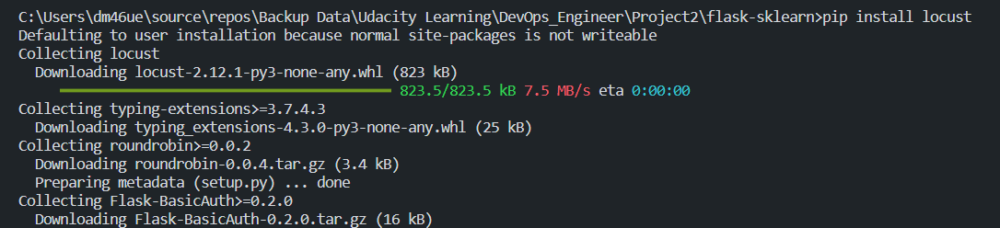
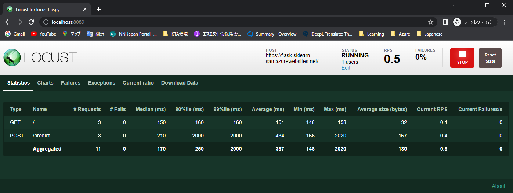
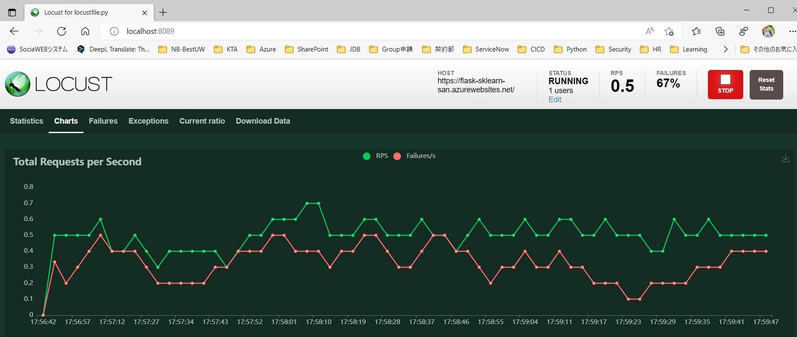

# Overview

Building a CI/CD Pipeline to deploy package to Azure WebApp using Azure Pipeline and GitHub Repository

## Project Plan

- [Trello board for the project](https://trello.com/b/IyE8zLp5/udacity-project)
- [Spreadsheet](/project-management.xlsx)

## Instructions

- Architectural Diagram(Shows how key parts of the system work)
  

<TODO: Instructions for running the Python project. How could a user with no context run this project without asking you for any help. Include screenshots with explicit steps to create that work. Be sure to at least include the following screenshots:

- Run `commands.sh` to deploy a webapp on Azure
  Change the webapp name you want `az webapp up -n <your-appservice>`
  
- Project running on Azure App Service
  [Open this URL](https://flask-sklearn-san.azurewebsites.net/)
  
- Project cloned into Azure Cloud Shell
  
- Passing tests that are displayed after running the `make all` command from the `Makefile`
  
  
- Output of a test run
  
  [](https://github.com/sannaingtun/udacity-flask-sklearn/actions/workflows/main.yml)
- Successful deploy of the project in Azure Pipelines. [Note the official documentation should be referred to and double checked as you setup CI/CD](https://docs.microsoft.com/en-us/azure/devops/pipelines/ecosystems/python-webapp?view=azure-devops).
  

- Running Azure App Service from Azure Pipelines automatic deployment
  

- Successful prediction from deployed flask app in Azure Cloud Shell. [Use this file as a template for the deployed prediction](https://github.com/udacity/nd082-Azure-Cloud-DevOps-Starter-Code/blob/master/C2-AgileDevelopmentwithAzure/project/starter_files/flask-sklearn/make_predict_azure_app.sh).
  
  The output should look similar to this:

```bash
udacity@Azure:~$ ./make_predict_azure_app.sh
Port: 443
{"prediction":[20.35373177134412]}
```

- Output of streamed log files from deployed application
  [Log File](/Logs/2022_09_20_lw0sdlwk0001TB_default_docker.log)
  >

## Load Testing using Locust

We can use locust to do a load test against our application.
In this example we will do a load test against the app running in azure.

Install locust and then run locust on command line:

```
pip install locust
locust
```


Open the url http://localhost:8089. Enter the total number of users to simulate, spawn rate, set the host to https://flask-sklearn-san.azurewebsites.net//, and click Start Swarming:



## Enhancements

- Need to modify API to be accessible from the App like Postman instead of running script

## Demo

[Demo Video](https://youtu.be/LDmhIRsGXxA)
